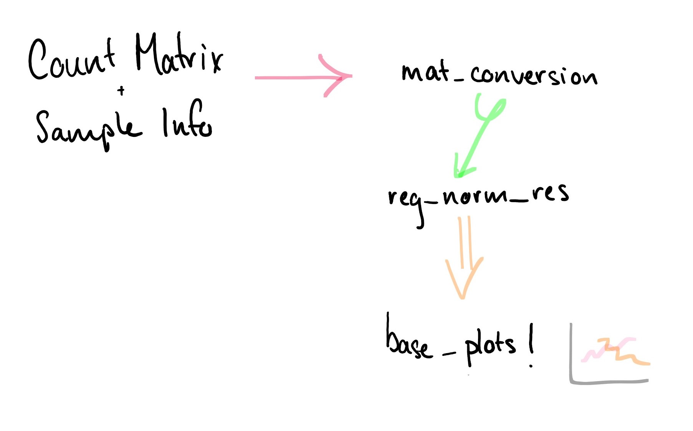

# vizRNASeq

## Description

The goal of vizRNASeq is to allow scientists to various ways to analyze RNASeq data.
Scientists can apply these methods to visualize clusters of genes to allow for progression of research into
different diseases such as Alzheimer’s or cancer.
Currently, Bioconductor has a workflow of an end to end gene level RNA-seq differential expression workflow
using their packages [1]. vizRNASeq creates a single package that
will not be producing their workflow but a small section of it for visualization. Although similar packages
exist that do far more complex analysis, this is a basic analysis

## Installation

To install the latest version of the package:

``` r
require("devtools")
devtools::install_github("bianca-pokhrel/vizRNASeq", build_vignettes = TRUE)
library("vizRNASeq")
```
To run shinyApp:


## Overview

To list all functions available in the package including functions from dependencies:

``` r
lsf.str("package:vizRNASeq")
```

The main components of the package are the pre-processing and the visualization. The pre-processing is made up of 2 functions currently- the conversion of a count matrix to a DESeqDataSet object and the compiling of its respective results. The visualization function is made up of one function that prints preliminary plots of the DESeqDataSet object. An image is included for reference.



``` r
browseVignettes("vizRNASeq")
```

## Contributions

The author of this package is Bianca Pokhrel

### mat_conversion:

This function is a compilation of the workflow used in Bioconductor's DESeq2 package. It takes the workflow and makes it possible to run the workflow in just a few lines rather than blocks of analyses. Additionally, it uses the dplyr package.

### reg_norm_res:

This function is a few short lines combining the workflow from Bioconductor's DESeq2 package to return the results of the pipeline after variance stabalizing transformation.

### base_plots:

This function compiles a few graphs for exploratory analysis from Bioconductor's DESeq2 package. It takes the workflow and runs most basic plots. Additionally, it uses ggplot2 and tidyverse

### cluster_map

This function creates plots for hierarchical and k-means clusters. It requires a DESeqDataSet object which can be generated using other functions available in this package. Additionally, it uses ggplot2, reshape to produce these plots which can then be accessed using the ShinyApp. See the shinyapp for a demonstration using the Pasilla dataset

## References

H. Wickham. Reshaping data with the reshape package. Journal of Statistical Software, 21(12), 2007.

R Core Team (2020). R: A language and environment for statistical computing. R Foundation for Statistical Computing, Vienna, Austria. URL https://www.R-project.org/.

Wickham et al., (2019). Welcome to the tidyverse. Journal of Open Source Software, 4(43), 1686, https://doi.org/10.21105/joss.01686

Wickham H (2016). ggplot2: Elegant Graphics for Data Analysis. Springer-Verlag New York. ISBN 978-3-319-24277-4, https://ggplot2.tidyverse.org.

Wolfgang Huber and Alejandro Reyes (2020). pasilla: Data
package with per-exon and per-gene read counts of RNA-seq
samples of Pasilla knock-down by Brooks et al., Genome
Research 2011.. R package version 1.18.0.

Michael I. Love, S. (2020, October 27). Analyzing RNA-seq data with DESeq2.
Retrieved November 18, 2020,
from http://bioconductor.org/packages/devel/bioc/vignettes/DESeq2/inst/doc/DESeq2.html

Love, M.I., Huber, W., Anders, S. Moderated estimation of
fold change and dispersion for RNA-seq data with DESeq2
Genome Biology 15(12):550 (2014)

Warner, J. (n.d.). BitBio. Retrieved December 10, 2020,
from https://2-bitbio.com/2017/10/clustering-rnaseq-data-using-k-means.html

Andrzej Oleś (2020). DEFormats: Differential gene expression data formats converter. R package version
1.18.0. https://github.com/aoles/DEFormats

## Acknowledgements

This package was developed as part of an assessment for 2020 BCB410H: Applied Bioinformatics, University of Toronto, Toronto,CANADA.
